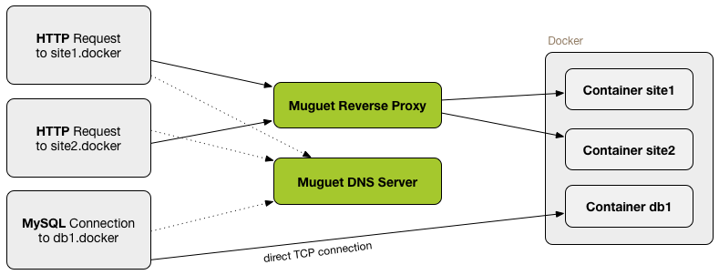

# Muguet

[](https://coveralls.io/github/mattallty/muguet?branch=master)

> *Muguet* is a DNS Server & Reverse proxy for Docker environments.


## Introduction

When using Docker, it's sometimes a pain to access your containers using specific IPs/ports.

*Muguet* provides you with a [DNS Server](https://en.wikipedia.org/wiki/Domain_Name_System) 
that resolves auto-generated hostnames to your containers IPs, 
plus a [Reverse Proxy](https://en.wikipedia.org/wiki/Reverse_proxy) to access all your web apps on port 80. 



## Prerequisites

  - A running [Docker](https://www.docker.com/) environment
  - [Node.js](https://nodejs.org/) or [io.js](https://iojs.org)

## Install

 - **Configure Networking**
 
```bash
# Add an alias to lo0 
sudo ifconfig lo0 alias 10.254.254.254

# Route paquets to the boot2docker VM
sudo route -n add 172.17.0.0/16 `boot2docker ip`

# Edit boot2docker profile by executing
boot2docker ssh -t 'sudo touch /var/lib/boot2docker/profile && echo EXTRA_ARGS=\"--dns 10.254.254.254\" | sudo tee /var/lib/boot2docker/profile'
 
# restart boot2docker VM
boot2docker restart
```

 - **Install Muguet**
```bash
npm install -g muguet
```

## Usage

```bash
sudo -E bash -c 'muguet [options]'
```

Notes:
  - *Muguet* **must** be run as *root* to be able to bind port 80
  - `sudo -E bash -c 'muguet [options]'` is recommended as it makes all needed environment variables available to the *muguet* command.

Available options:

```
-h | --help            Display help
--domain[=docker]      Set your domain. (set the /etc/resolver/{domain} accordingly)
--proxy-ip[=127.0.0.1] IP of the proxy server. Specify it when not in a local environment.
--api-port[=9876]      Set the REST API port
--dns-ip[=127.0.0.1]   IP of the DNS server
--dns-port[=53]        Set the DNS server port
```

## Generated hostnames

For each container, *Muguet* generates several DNS entries:

  - `container_id`.docker
  - `hostname`.docker (when running a container with -h option)
  - `compose-service`.docker (if using Docker Compose)
  - And possibly others based on the `org.muguet.dns.subdomain-map` label (see below) 


## Labels

Docker `labels` are used as configuration settings.

#### org.muguet.reverse-proxy.enabled

Set it to `1` to enable the reverse-proxy (only enable reverse-proxy for web apps).


#### org.muguet.reverse-proxy.only-ports

A comma-separated list of ports that you want to *proxify*. 


#### org.muguet.dns.subdomain-map

A comma-separated list of `subdomain:port` to map.

## Example

```yml
# site1 will be accessible on http://site1.docker 
site1:
  build: ./build/docker/site1
  ports:
    - "8081"
  labels:
    # We enable the reverse-proxy so the app will be available on port 80 rather than 8081
    - "org.muguet.reverse-proxy.enabled=1" 
    
# site2 will be accessible on http://site2.docker and on http://back-office.docker 
site2:
  build: ./build/docker/site2
  hostname: back-office
  ports:
    - "8082"
  labels:
    # We enable the reverse-proxy so the app will be available on port 80 rather than 8082
    - "org.muguet.reverse-proxy.enabled=1"
      
# More complex      
# despite not recommended, this container expose several services (mysql, apache, node.js)
# So we have to setup a subdomain-map so each service will be given a distinct hostname
bigcontainer: 
  image: big/big-container
  ports:
    - "3306"
    - "80"
    - "8990"
  labels:
    # Enable reverse-proxy
    - "org.muguet.reverse-proxy.enabled=1"
    # Reverse-proxy only web apps, but NOT MySQL
    - "org.muguet.reverse-proxy.only-ports=80,8990"
    # Will bind:
    #   apache.bigcontainer.docker
    #   nodejs.bigcontainer.docker
    #   mysql.bigcontainer.docker
    - "org.muguet.dns.subdomain-map=apache:80,nodejs:8990,mysql:3306"
    
```
    
## REST API

A REST API is available on port `9876` (customizable with `--api-port`) 
to retrieve the reverse-proxy routes as well as DNS entries.
A default domain `muguet.docker`is generated so you can access the API through [http://muguet.docker:9876](http://muguet.docker:9876)

### Routes
    
#### GET /proxy-routes

Sample response:

```json
[
   {
      "hostname": "amc.docker",
      "hostname_aliases": [
         "6e99d3b06a96.docker"
      ],
      "port": 80,
      "container_public_addr": "192.168.59.103",
      "container_public_port": 32807,
      "container_private_addr": "172.17.0.27",
      "container_private_port": 8081,
      "stats": {
         "requestsPerSecond": {
            "mean": 0.2966363784797275,
            "count": 31,
            "currentRate": 0,
            "1MinuteRate": 0.10176713940255401,
            "5MinuteRate": 0.07466202401314313,
            "15MinuteRate": 0.030908019247845135
         }
      }
   },
   {
      "hostname": "bidder.docker",
      "hostname_aliases": [
         "716aed81e348.docker"
      ],
      "port": 80,
      "container_public_addr": "192.168.59.103",
      "container_public_port": 32805,
      "container_private_addr": "172.17.0.26",
      "container_private_port": 8888,
      "stats": {
         "requestsPerSecond": {
            "mean": 0.1465148084182472,
            "count": 11,
            "currentRate": 0.14651508145817516,
            "1MinuteRate": 0.07930845785007225,
            "5MinuteRate": 0.030976204019790073,
            "15MinuteRate": 0.011553349126873487
         }
      }
   },
   {
      "hostname": "ggs.docker",
      "hostname_aliases": [
         "af9fcb68cba5.docker"
      ],
      "port": 80,
      "container_public_addr": "192.168.59.103",
      "container_public_port": 8977,
      "container_private_addr": "172.17.0.24",
      "container_private_port": 80,
      "stats": {
         "requestsPerSecond": {
            "mean": 2.483748695174352,
            "count": 98,
            "currentRate": 2.4837488374391983,
            "1MinuteRate": 1.145862706419387,
            "5MinuteRate": 0.30380239525696306,
            "15MinuteRate": 0.10627732962540533
         }
      }
   },
   {
      "hostname": "elastic.elk.docker",
      "hostname_aliases": [
         "elastic.204e82433b37.docker"
      ],
      "port": 80,
      "container_public_addr": "192.168.59.103",
      "container_public_port": 32799,
      "container_private_addr": "172.17.0.23",
      "container_private_port": 9200,
      "stats": {
         "requestsPerSecond": {
            "mean": 0.17819638140552524,
            "count": 3,
            "currentRate": 0.17819639593817688,
            "1MinuteRate": 0.04060856509152555,
            "5MinuteRate": 0.009592005588775196,
            "15MinuteRate": 0.0032873612833828627
         }
      }
   },
   {
      "hostname": "kibana.elk.docker",
      "hostname_aliases": [
         "kibana.204e82433b37.docker"
      ],
      "port": 80,
      "container_public_addr": "192.168.59.103",
      "container_public_port": 8976,
      "container_private_addr": "172.17.0.23",
      "container_private_port": 80,
      "stats": {
         "requestsPerSecond": {
            "mean": 3.3543803658698623,
            "count": 19,
            "currentRate": 3.354381223966475,
            "1MinuteRate": 0.3038312244085719,
            "5MinuteRate": 0.06280847547785395,
            "15MinuteRate": 0.021052577581392007
         }
      }
   }
]
```

#### GET /dns-entries

Sample response:

```json
{
  "amc.docker": "127.0.0.1",
  "6e99d3b06a96.docker": "127.0.0.1",
  "bidder.docker": "127.0.0.1",
  "716aed81e348.docker": "127.0.0.1",
  "aerospike.docker": "172.17.0.25",
  "7bca6d1858ca.docker": "172.17.0.25",
  "ggs.docker": "127.0.0.1",
  "af9fcb68cba5.docker": "127.0.0.1",
  "elk.docker": "127.0.0.1",
  "204e82433b37.docker": "127.0.0.1",
  "elastic.elk.docker": "127.0.0.1",
  "elastic.204e82433b37.docker": "127.0.0.1",
  "kibana.elk.docker": "127.0.0.1",
  "kibana.204e82433b37.docker": "127.0.0.1"
}
```